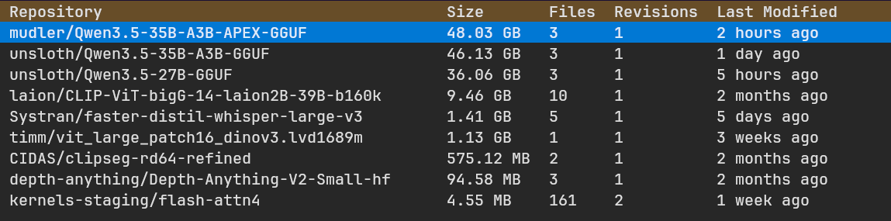

# hf-cache - Hugging Face Cache Manager

A terminal user interface (TUI) application for browsing and managing locally downloaded Hugging Face models and datasets.

## Features

- **Browse local cache**: View all locally downloaded Hugging Face models and datasets with details like size, file count, revisions, and last modified time
- **Sort by columns**: Click on table headers to sort by repository, size, files, revisions, or last modified time
- **Delete cache entries**: Remove models and datasets from your local cache with Enter confirmation
- **Keyboard navigation**: Navigate with arrow keys, confirm with Enter, cancel with Escape, quit with q

## Prerequisites

- Nix (with flakes enabled)

## Installation

```bash
# Clone the repository
cd hf-cache

# Enter development shell
nix develop

# Or install globally
nix profile install .
```

## Usage

```bash
# Run directly from repository
nix run github:knoopx/hf-cache

# Or after installing globally
hf-cache
```

### Note

The application reads the Hugging Face cache from `~/.cache/huggingface/` by default.

## Keyboard Shortcuts

| Key      | Action                |
| -------- | --------------------- |
| `q`      | Quit application      |
| `r`      | Refresh cache list    |
| `d`      | Delete selected entry |
| `s`      | Sort by size          |
| `Enter`  | Confirm deletion      |
| `Escape` | Cancel deletion       |

## Main Screen

The main screen displays a table of all locally cached Hugging Face content with the following columns:



- **Repository**: The repository ID (e.g., `bert-base-uncased`)
- **Size**: Human-readable size (MB or GB)
- **Files**: Number of files in the cache entry
- **Revisions**: Number of revisions stored
- **Last Modified**: Time since last modification

## Controls

- **Click headers**: Sort by the selected column
- **Arrow keys**: Navigate through entries
- **Delete (d)**: Delete the currently selected cache entry
- **Refresh (r)**: Reload the list from cache
- **Enter**: Confirm deletion when prompted
- **Escape**: Cancel deletion

## Delete Confirmation

When deleting a cache entry, press Enter to confirm or Escape to cancel. The status bar shows the confirmation prompt.

## Technical Details

- Built with [Textual](https://textual.textualize.io/) - a modern Python TUI framework
- Uses [huggingface_hub](https://github.com/huggingface/huggingface_hub) library to scan the Hugging Face cache directory
- Python 3.13+

## Flake Outputs

This flake provides two outputs:

- **packages.x86_64-linux.default**: Builds the hf-cache Python package with all dependencies (huggingface-hub, rich, textual)
- **apps.x86_64-linux.default**: Defines the hf-cache executable that can be run with `nix run` or installed globally
